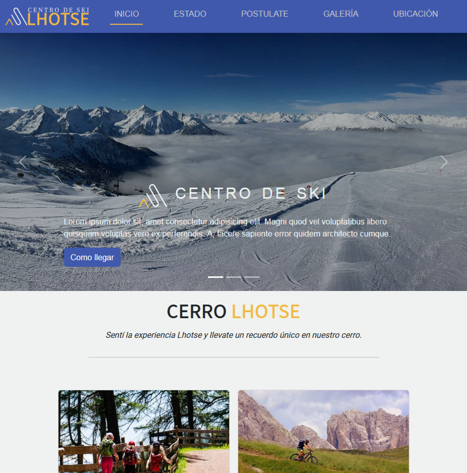

# Final project of the Web Developer course by Coderhouse 

## About this site :globe_with_meridians:

### Centro de ski Lhotse :snowboarder:
This is a fictional ski resort static website that implements HTML, CSS&SCSS and Bootstrap as a Framework.
It´s my first "big" project since I started with this amazing world of web development. I hope you enjoy it :smile:.

Here are some facts to remark:
* The brand identity (name, logo and color palette) were created by me.

* This site has 6 pages: index, galery, location, work, state and notReady. The objective of notReady is to inform the user that the page he wants to visit is currently on "develope". The other pages fulfill their corresponding theme.

* Inside the repo you can find two PDF documents. One of them explains the changes made in the project during one of the pre-submit stages to improve the SEO of the site. The other one is a budget based on the delivery-times and design of the project.

## Screenshot :iphone:

## Technologies used

## Do you want to see the site?? Link to netlify :arrow_down:
### https://cerro-lhotse.netlify.app/index.html
